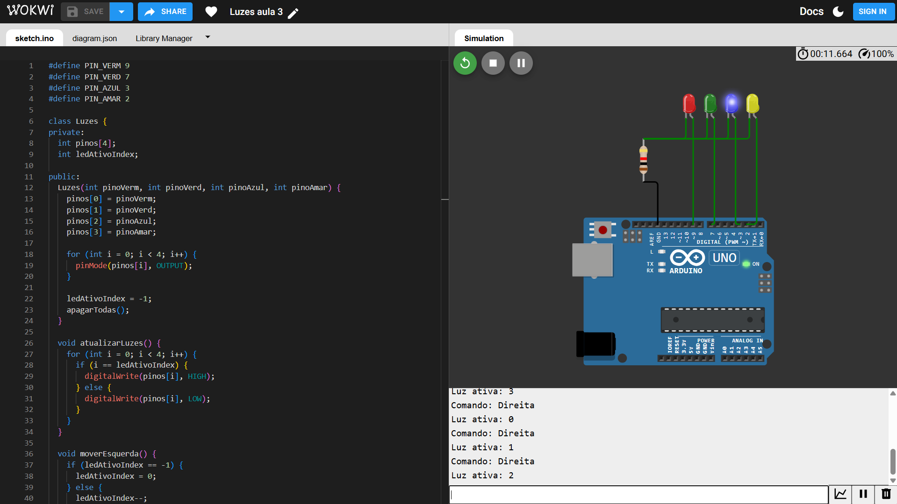

# Atividade P.O.O

Este repositório contém a atividade desenvolvida em sala sobre Programação Orientada a Objetos (P.O.O).

## Atividade

A atividade pode ser acessada através do seguinte link:

[Link para a Atividade no Wokwi](https://wokwi.com/projects/445528895944764417)
